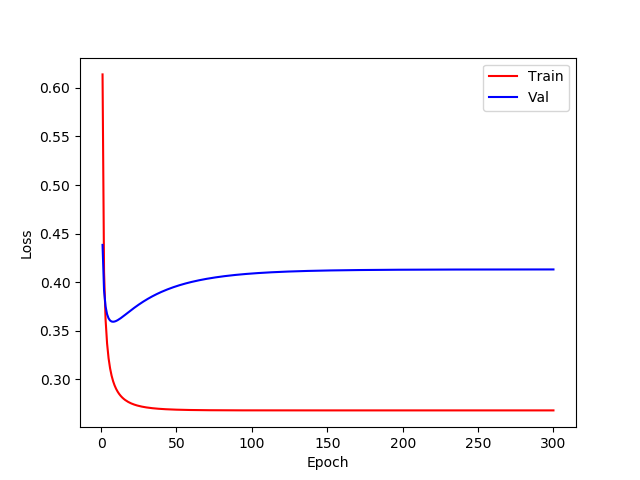

# CMPUT-651-UofA


## Data preparation 

Download IMDB data from [kaggle](https://www.kaggle.com/iarunava/imdb-movie-reviews-dataset)
, unzip it and it will have the following structure. 
Assume ``aclImdb`` is under the root directory of this project.

```
aclImdb
    |-- train
        |-- pos
        |-- neg
        |-- unsup
    |-- test
        |-- pos
        |-- neg
```
## Training curve


## Result

Best val loss at: 7 th epoch
Test accuracy is: 0.842000


