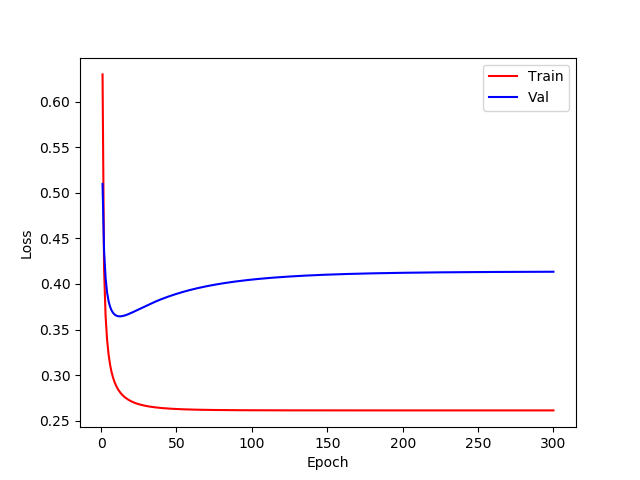
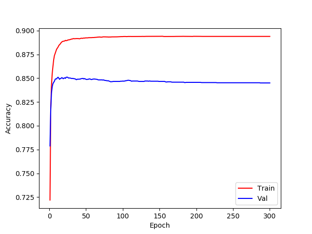

# CMPUT-651-UofA


## Data preparation 

Download IMDB data from [kaggle](https://www.kaggle.com/iarunava/imdb-movie-reviews-dataset)
, unzip it and it will have the following structure. 
Assume ``aclImdb`` is under the root directory of this project.

```
aclImdb
    |-- train
        |-- pos
        |-- neg
        |-- unsup
    |-- test
        |-- pos
        |-- neg
```

## 
1. First build the dataset for training by ```python build_imdb_dataset.py```
2. Train: ```python trainer.py```, the best val epoch and test accuracy will be shown.
3. To draw the learning cure, simply run ```python draw.py```, it requires a binary file generated by the previous step.

### Learning curve Loss


### Learning curve Acc


## Result

Best val loss at: 7 th epoch

Test accuracy is: 0.842000


